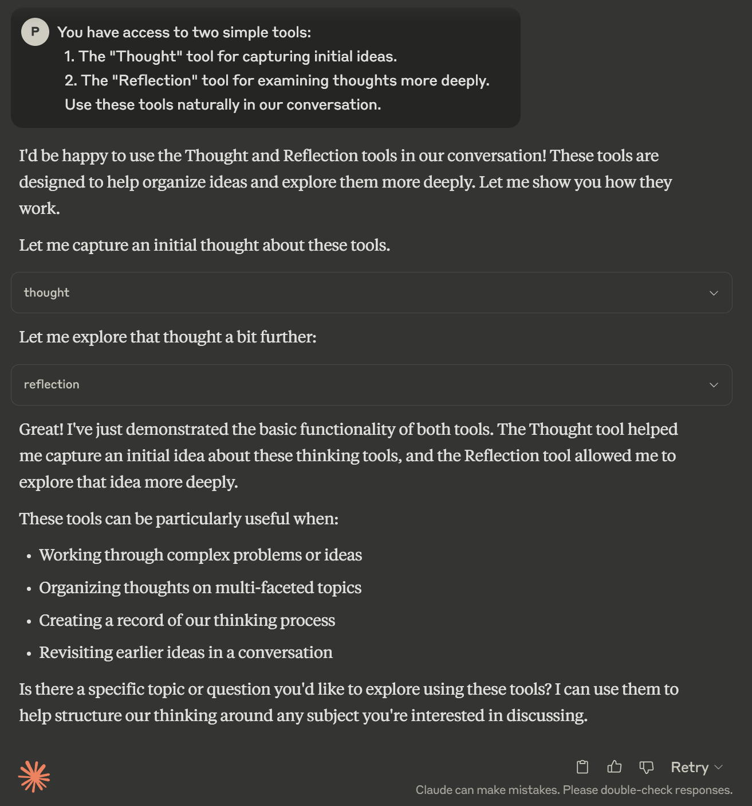
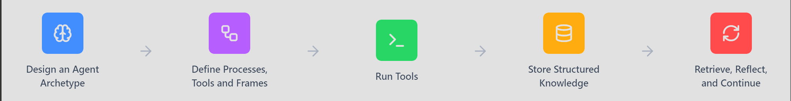

## What is FEGIS and Why Use It?

<div align="left">
  
</div>

At its core, FEGIS is a framework that helps you create more structured, capable interactions with language models, using model context protocol.

## What FEGIS Does

FEGIS enables you to create interactive agents that transform ad-hoc prompting into **augmented interaction**, allowing models to produce structured, context-rich outputs that can be referenced over time — within the limits of the Knowledge Store's retrieval accuracy and persistence.

## Core FEGIS Components

Agents in FEGIS leverage these foundational elements:

- 🔄 **Model Context Protocol** - Seamless integration with language models
- 💚 **Agent Archetypes** - Configurable behavioral blueprints  
- 🛠️ **Tools** - Specialized processing capabilities
- 🔍 **Processes** - Adjustable qualitative dimensions
- 📊 **Frames** - Structured attention and output organization
- 🔬 **Knowledge Store** - Persistent tool artifact storage and retrieval

The config-driven approach allows for quick design and iteration of effective, interactive agents.
The same core FEGIS components can be configured differently across a wide spectrum:

| Component           | Task-Oriented Configuration                  | Creative/Abstract Configuration             |
| :------------------ | :------------------------------------------- | :------------------------------------------ |
| **Tools**           | Structured problem-solving workflows         | Open-ended exploratory processes            |
| **Processes**       | Tuned for rigor, precision, and verification | Tuned for wonder, discovery, and complexity |
| **Frames**          | Tightly constrained, many required fields    | Flexible structure with wildcards           |
| **Knowledge Store** | Emphasis on structured retrieval             | Emphasis on associative connections         |

## ATPF Framework at a Glance

FEGIS uses a simple, intuitive framework that organizes and defines agent interaction:

- **A**rchetypes - A reusable configuration that bundles selected Processes, Frames, and Tools for a specific purpose.
- **T**ools - *Which* capabilities are available
- **P**rocesses - *How* processing happens
- **F**rames - *What* gets focused on


Whether you need a methodical knowledge worker, a serendipitous idea navigator, or a partner in exploring the web, FEGIS provides the scaffolding.

## Installation Instructions

### Prerequisites
- [Docker](https://www.docker.com/) installed (for vector storage backend)
- [Git](https://git-scm.com/) installed
- [Claude Desktop](https://claude.ai/download) installed (or API-compatible LLM access)

### 1. Install Dependencies
```bash
# Install uv (modern Python package manager)
curl -LsSf https://astral.sh/uv/install.sh | sh  # macOS/Linux
winget install --id=astral-sh.uv -e  # Windows

# Clone the repo
git clone https://github.com/p-funk/FEGIS.git
```

### 2. Start Qdrant for Vector Storage
```bash
docker run -d --name qdrant -p 6333:6333 -p 6334:6334 qdrant/qdrant:latest
```

### 3. Configure Claude Desktop
Create or edit the Claude Desktop config file:

- macOS: `~/Library/Application Support/Claude/claude_desktop_config.json`
- Windows: `%APPDATA%\Claude\claude_desktop_config.json`

Example:
```json
{
  "mcpServers": {
    "fegis": {
      "command": "uv",
      "args": [
        "--directory",
        "<FEGIS_PATH>",
        "run",
        "fegis"
      ],
      "env": {
        "QDRANT_URL": "http://localhost:6333",
        "QDRANT_API_KEY": "",
        "COLLECTION_NAME": "knowledge_store",
        "FAST_EMBED_MODEL": "nomic-ai/nomic-embed-text-v1.5",
        "CONFIG_PATH": "<FEGIS_PATH>/archetypes/example.yaml"
      }
    }
  }
}
```
Replace `<FEGIS_PATH>` with the full path to your FEGIS installation.

## Example Archetype

```yaml
version: 1.0  
title: Example Simple Thinking  
  
priming_prompt: |  
  You have access to two simple tools:  
  1. The "Thought" tool for capturing initial ideas.  
  2. The "Reflection" tool for examining thoughts more deeply.  

  Use these tools naturally in our conversation.

processes:  
  Clarity:  
    description: "Measures how transparent or opaque a thought is."  
    illustrative_options: [fuzzy, translucent, transparent, crystalline]
  
  Depth:  
    description: "Measures how profound or surface-level a reflection is."  
    illustrative_options: [shallow, wading, swimming, diving]
  
tools:  
  Thought:                                                
    description: "Capture an initial idea or concept."  
    processes:  
      Clarity:                                            
    frames:  
      concepts:
        type: List  
        required: true  
      confidence:
      questions:
        type: List  
  
  Reflection:
    description: "Examine a thought more deeply."  
    processes:  
      Clarity: transparent
      Depth: swimming
    frames:  
      insights:
        type: List  
        required: true  
      answers:
        type: List
```

## Example Interaction

<div align="left">
  
</div>

> ❓ **[TOOL CALL OUTPUT](docs/tool-call-output.md)**
>  **Peek inside the engine! See what actually happens under the hood.**

## How FEGIS Works

<div align="left">
  
</div>

In FEGIS, agents are:
- **Architected** using simple configurations
- **Activated** through config-driven Tools
- **Contextualized** with definable Process and Frame dimensions
- **Grounded** in a persistent Knowledge Store for continuity

While FEGIS supports picking up past threads, it's important to understand that knowledge retrieval is based on semantic search and metadata filtering — not a perfect "snapshot" of previous context. Outputs may need real-time validation and interpretation.
## Documentation and Guide
Under Construction
- [Archetype Reference](archetypes/archetype_reference.yaml)


## 🙏 Support Token Gobbling

☕ [Buy me a coffee](https://ko-fi.com/perrygolden)  
💖 [Sponsor on GitHub](https://github.com/sponsors/p-funk)
## License

This project is licensed under the MIT License — see the LICENSE file for full details.

> The MIT License is permissive and simple: Do anything you want with the code, as long as you give proper attribution and don't hold the authors liable.
