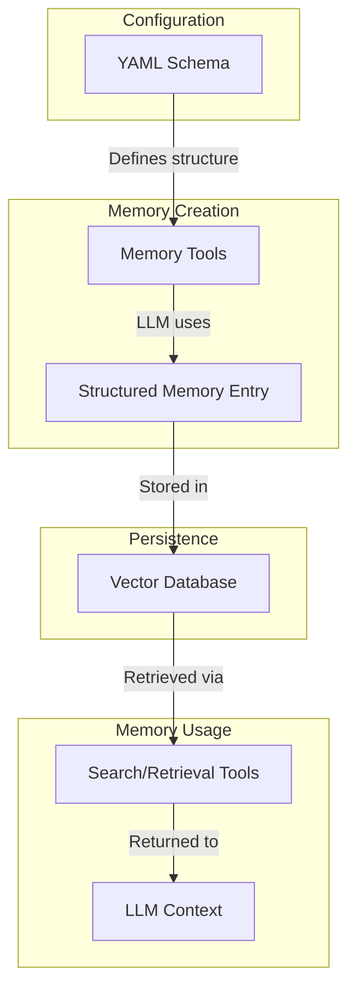
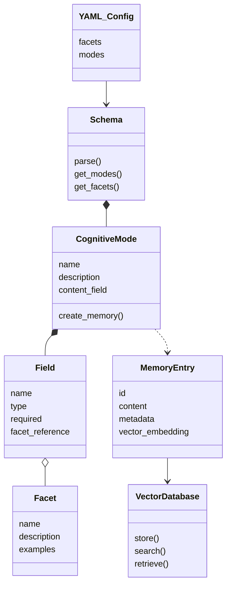

## Emergent Tool Selection

One of the most powerful aspects of FEGIS is how it enables truly emergent behavior in tool selection. Unlike rigid function calling systems, LLMs don't just respond to explicit instructions - they develop agency in choosing which cognitive tools to use and when.

When properly prompted, the LLM will:

- Dynamically choose which cognitive tool is most appropriate for a given situation
- Switch between different modes of thinking as the conversation evolves
- Create memories without explicit instructions when it encounters important information
- Search for relevant memories on its own when helpful

This emergent agency in tool selection makes interactions feel natural rather than mechanical. The cognitive tools become extensions of the LLM's thinking process, not just function calls. The model develops its own preferences and patterns in how it approaches different types of information - almost like developing a personality.

## Data Management and Transparency

FEGIS stores all memory entries in your local Qdrant vector database, giving you complete visibility and control over your data.

### Accessing the Qdrant Dashboard

You can view, manage, and delete memory entries through Qdrant's web dashboard:

1. Access the dashboard at: http://localhost:6333/dashboard
2. Navigate to the "Collections" tab
3. Select your FEGIS collection (default: "fegis")

### Dashboard Features

The Qdrant dashboard allows you to:

- View all stored memory entries in detail
- Examine metadata and vector embeddings
- Search memories using vector similarity
- Delete individual memories or entire collections
- Export memory data for backup or analysis

This transparency gives you complete oversight of what your models remember and how that information is stored, supporting both privacy and data governance requirements.

## How FEGIS Works

FEGIS transforms YAML definitions into cognitive tools that create and retrieve structured memories. Here's the memory flow process:



# FEGIS Customization Guide

This guide explains how to create and customize cognitive frameworks in FEGIS.

## Cognitive Framework Structure

Here's how the FEGIS framework components relate to each other:




## Schema Anatomy

A FEGIS schema is defined in YAML and contains two main sections:

```yaml
facets:
  # Qualitative dimensions go here
  
modes:
  # Memory types go here
```

### Facets

Facets are reusable metadata categories with example values:

```yaml
facets:
  Importance:
    description: "How important a thought is"
    facet_examples:
      - trivial
      - minor
      - moderate 
      - significant
      - crucial
```

Importantly, the `facet_examples` field provides one-shot learning examples directly to the model. The model actually sees these examples as part of the tool description, helping it understand the expected range and type of values for each facet. This guides the model to use consistent terminology when categorizing memories, making them more effectively searchable by these qualities.

### Modes

Modes define different types of thinking or memory:

```yaml
modes:
  Idea:
    description: "Use this tool to capture creative ideas as they emerge"
    content_field: "idea_content"
    fields:
      # Fields go here
```

Each mode requires:
- A descriptive name (becomes the tool name)
- A description (becomes the tool instructions)
- A `content_field` identifying the main content
- A set of fields defining the memory structure

### Fields

Fields define the structured components of a memory:

```yaml
fields:
  idea_title:
    type: "str"
    required: true
    description: "A concise title for the idea"
  
  idea_content:
    type: "str"
    required: true
    description: "The full explanation of the idea"
  
  importance:
    type: "str"
    required: false
    default: "moderate"
    facet: "Importance"
  
  related_concepts:
    type: "List[str]"
    required: false
    default: null
    description: "Connected concepts"
```

Field attributes:
- `type`: Data type (`str` or `List[str]`)
- `required`: Whether the field must be provided
- `description`: What the field captures
- `facet`: Optional reference to a facet
- `default`: Default value for optional fields

## Relationship Fields

Fields of type `List[str]` create relationships between memories:

```yaml
concepts:
  type: "List[str]"
  required: false
  default: null
  description: "Key concepts in this memory"
```

These list fields enable:
- Semantic connections between memories
- Finding related entries through common elements
- Building knowledge networks across memory types

## Built-in Search Tools

FEGIS automatically provides two powerful search tools:

### search_memories

Searches for memories by content, mode, or metadata:

```
search_memories({
  "query": "concept to search for",
  "mode": "optional type filter",
  "facet_filter": {"importance": "significant"},
  "limit": 5
})
```

### retrieve_memory

Retrieves a specific memory by its ID:

```
retrieve_memory({
  "memory_id": "unique-memory-identifier"
})
```

## Simple Framework Example

Here's a simple cognitive framework example:

```yaml
facets:
  Importance:
    description: "How important a thought is"
    facet_examples:
      - trivial
      - minor
      - moderate
      - significant
      - crucial
      
  Confidence:
    description: "How confident you are"
    facet_examples:
      - uncertain
      - tentative
      - moderate
      - confident
      - certain
      
  Clarity:
    description: "How clear a thought is"
    facet_examples:
      - clouded
      - hazy
      - translucent
      - transparent
      - crystalline

modes:
  Idea:
    description: "Use this tool to capture creative ideas as they emerge"
    content_field: "idea_content"
    fields:
      idea_title:
        type: "str"
        required: true
      idea_content:
        type: "str"
        required: true
      importance:
        type: "str"
        required: false
        default: "moderate"
        facet: "Importance"
      confidence:
        type: "str"
        required: false
        default: "moderate"
        facet: "Confidence"
      clarity:
        type: "str"
        required: false
        default: "translucent"
        facet: "Clarity"
      concepts:
        type: "List[str]"
        required: false
        default: null
  
  Question:
    description: "Use this tool to record questions that need exploration"
    content_field: "question_content"
    fields:
      question_title:
        type: "str"
        required: true
      question_content:
        type: "str"
        required: true
      importance:
        type: "str"
        required: false
        default: "moderate"
        facet: "Importance"
      related_ideas:
        type: "List[str]"
        required: false
        default: null
```

## Creating Your Own Framework

FEGIS gives you the flexibility to design cognitive memory frameworks tailored to your specific needs. You can start with the included phenomenology.yaml example as a reference, then create your own cognitive framework from scratch.

## Effective Prompt Templates

To help your LLM develop emergent tool use, include prompt guidance like:

```
Throughout our conversation, use your tools naturally and fluidly as part of your discourse.

When relevant:
- Choose which cognitive tool best fits your current thought process
- Search for and reference related memories using search_memories when helpful
- Intuit the which tools to use as the conversation evolves

Let your tools become an extension of how you think, not just functions to be called.
```

## Data Ownership and Privacy

FEGIS is designed with data ownership and privacy in mind:

- **Local Database**: All memory data is stored in your local Qdrant instance - not in a cloud service
- **Complete Control**: You can back up, delete, or migrate your memory database at any time
- **No External Dependencies**: Once set up, FEGIS works entirely on your local machine without external API calls
- **Portable Data**: Your cognitive framework and memories can be exported or shared as you choose

This approach ensures that your model's memories remain under your complete control, unlike cloud-based solutions where your data might be stored on third-party servers.

### Common Issues

**Problem**: Tools don't appear in the client
- Verify YAML syntax is correct (indentation matters)
- Check all referenced facets exist
- Restart the client after config changes
- Examine MCP logs for errors

**Problem**: Memory not persisting
- Verify Qdrant is running
- Check collection_name and database connection settings
- Ensure the proper embedding model is installed

**Problem**: LLM not using tools effectively
- Provide clearer instructions in your prompt
- Define more intuitive mode descriptions
- Consider simplifying complex cognitive frameworks initially

### Logs Location

Check the MCP logs for detailed error information:
- macOS: `~/Library/Logs/Claude`
- Windows: `%APPDATA%\Claude\logs`

## Advanced Tips

1. **Coherent Framework Design**: Create modes that naturally complement each other
2. **Progressive Complexity**: Start with a simple framework and add complexity gradually
3. **Intuitive Descriptions**: Mode descriptions directly influence how the LLM uses the tools
4. **Default Values**: Set sensible defaults to reduce cognitive overhead
5. **Relationship Planning**: Design relationship fields to create meaningful memory networks